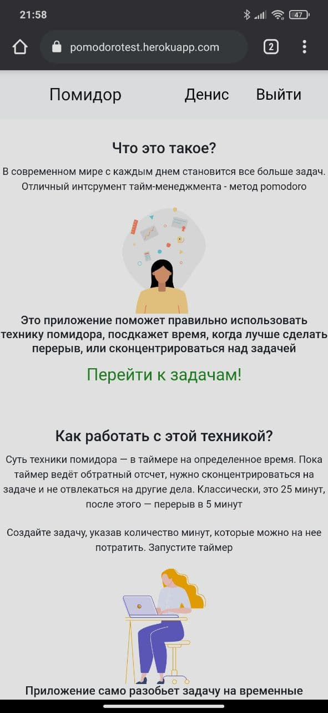
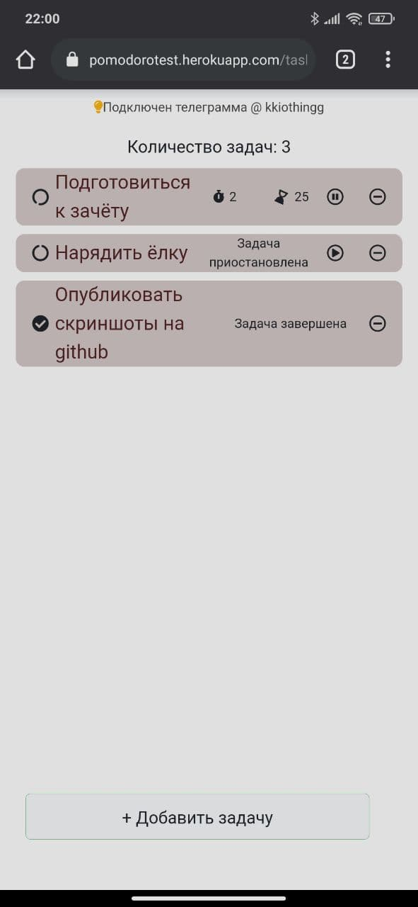
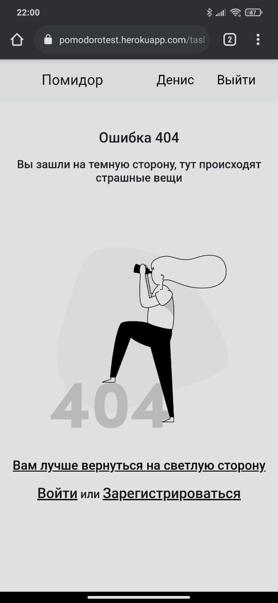

# PomodoroApp
https://pomodorotracker.ru/

SPA приложение списка задач, реализующее технику помодоро (разбиение задачи на промежутки по 25 минут)

Front-end: React.js

Back-end:  Web Api Asp.NET.Core (5.0)

DB:MSSQL

Приложение опубликованно с помощью контейнера Docker

Основные возможности:
1 ![alt text] Создание и автоматическое разбиение задач на промежтку методом pomodoro.
2![alt text]  Перезапуск задачи, возможность поставить ее на паузу.
3 ![alt text]Уведомления с помощью telegram_bot'a. 
4![alt text] Ежедневная рассылка со списком задач в telegram. 

;

;

;

;
